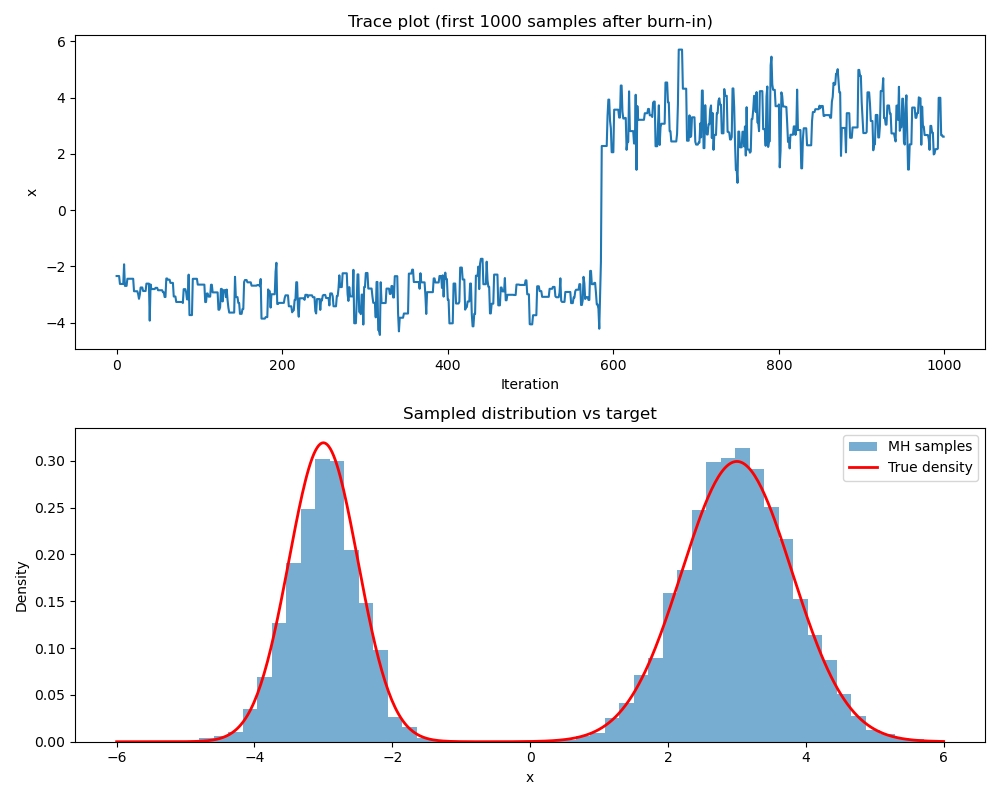

---
​---
title: "Metropolis-Hastings Sampling"
layout: post
date: 2026-05-25
headerImage: false
tag:
- MCMC
- Bayesian Inference
star: true
category: blog
author: JiadiBao
description: MHsampling
​---
---

# Metropolis-Hastings Sampling for Gaussian Mixture Model

#### *Last updated at 26-05-2026 by Jiadi Bao*

Markov Chain Monte Carlo (MCMC) is a class of algorithms for sampling from a probability distribution when direct sampling is difficult. The Metropolis-Hastings (MH) algorithm is one of the most fundamental MCMC methods. It constructs a Markov chain whose stationary distribution equals the target distribution, allowing us to generate correlated samples that approximate draws from the target.

There are some useful materials, which I believe are helpful for understanding the beautiful method of Variation Inference.

- 

This tutorial introduces the Metropolis-Hastings algorithm, its theoretical underpinnings, and a practical implementation in Python. We will sample from a bimodal distribution to illustrate the algorithm's ability to explore complex densities.

---

```python
import numpy as np
import matplotlib.pyplot as plt
import seaborn as sns
from scipy.stats import norm, multivariate_normal
%matplotlib inline
```


## Metropolis-Hastings Algorithm

### 1. Problem Setup

Suppose we have a target distribution $\pi(x)$, in Bayesian Inference, it is often a posterior distribution. That is, we know $f(x)\propto \pi(x)$ but cannot directly sample from $\pi$. The goal is to generate a sequence of samples $\{x_0, x_1,\cdots \}$ such that for a large $t$, $x_t$ approximately follows $\pi$.


### 2. Algorithm Description

The MH algorithm proceeds as follows, given a current state $x_t$:

1. Propose a new state $x^\prime$ according to a proposal distribution $q(x^\prime|x_t)$.
2. Compute the acceptance ratio: 

$$
\alpha(x_t,x^\prime) = min\left(1, \frac{\pi(x^\prime)q(x_t|x^\prime)}{\pi(x_t)q(x^\prime|x_t)}\right)
$$

3. Accept $x^\prime$ with probability $\alpha$; otherwise, let $x_{t+1} = x_t$.


### 3. The Essense: The Detailed Balance

The MH algorithm defines a Markov chain with detailed balance condition:
$$
\pi(x_t)q(x^\prime|x_t) \alpha(x_t,x^\prime) = \pi (x^\prime)q(x_t|x^\prime)\alpha(x^\prime,x_t)
$$
This ensures that $\pi$ is the stationary distribution. The chain eventually converges to $\pi$ under mild regularity conditions.

### 4. GMM example

Consider a mixture of two Gaussians:
$$
\pi (x) = 0.4\mathcal{N}(-3, 0.5^2) + 0.6\mathcal{N}(3,0.8^2).
$$
We will sample from this distribution using a simple **random walk Metropolis** with a Gaussian proposal distribution :
$$
q(x^\prime|x_t) = \mathcal{N}(x^\prime|x_t, \sigma^2)
$$
The acceptance ratio becomes:
$$
\alpha = min\left(1, \frac{\pi(x^\prime)}{\pi(x_t)}\right)
$$
The target pdf can be coded:

```python
def target_pdf(x):
    return 0.4 * norm.pdf(x, loc=-3, scale=0.5) + 0.6 * norm.pdf(x, loc=3, scale=0.8)
```

We can implement the MH sampler:

```python
def metropolis_hastings(target, proposal_sampler, proposal_log_pdf, initial_state, n_samples):
    
    samples = np.zeros((n_samples, *np.shape(initial_state)))
    samples[0] = initial_state
    accepted = 0

    x_current = initial_state
    log_target_current = target(x_current)

    for i in range(1, n_samples):
        # Propose new state
        x_proposal = proposal_sampler(x_current)
        log_target_proposal = target(x_proposal)

        # Compute log acceptance ratio (for symmetric proposal, q(x'|x) = q(x|x'))
        log_alpha = log_target_proposal - log_target_current
        # For general asymmetric proposal, add proposal log ratio:
        # log_alpha += proposal_log_pdf(x_current, x_proposal) - proposal_log_pdf(x_proposal, x_current)

        if np.log(np.random.rand()) < log_alpha:
            # Accept
            x_current = x_proposal
            log_target_current = log_target_proposal
            accepted += 1

        samples[i] = x_current

    accept_rate = accepted / (n_samples - 1)
    return samples, accept_rate
```

We also need to code the proposal sampler:

```python
def proposal_sampler(x_current, prop_sigma=1.0):
    return x_current + np.random.normal(0, prop_sigma)
```

### 5. Implementation Detail

```python
prop_sigma = 1
initial_state = 0.0
n_samples = 20000
burn_in = 5000

# Run MH
proposal_sampler_func = make_proposal_sampler(prop_sigma)
samples, acc_rate = metropolis_hastings(
    target=lambda x: np.log(target_pdf(x) + 1e-300),  # small offset to avoid log(0)
    proposal_sampler=proposal_sampler_func,
    proposal_log_pdf=lambda xp, xc: proposal_log_pdf(xp, xc, prop_sigma),
    initial_state=initial_state,
    n_samples=n_samples
)

print(f"Acceptance rate: {acc_rate:.3f}")

# Discard burn-in
samples = samples[burn_in:]
```

### 6. Visualization

We can draw histogram of the drawed samples and compare it with the true density.

```python	
fig, axes = plt.subplots(2, 1, figsize=(10, 8))

# Trace plot
axes[0].plot(samples[:1000])  # first 1000 after burn-in
axes[0].set_title('Trace plot (first 1000 samples after burn-in)')
axes[0].set_xlabel('Iteration')
axes[0].set_ylabel('x')

# Histogram vs true density
axes[1].hist(samples, bins=50, density=True, alpha=0.6, label='MH samples')
x_grid = np.linspace(-6, 6, 500)
axes[1].plot(x_grid, target_pdf(x_grid), 'r-', lw=2, label='True density')
axes[1].set_title('Sampled distribution vs target')
axes[1].set_xlabel('x')
axes[1].set_ylabel('Density')
axes[1].legend()
plt.tight_layout()
```



### A Glimpse  of Sample Size

We can find out the effectiveness of the drawed samples by calculating the corrlation between the true data and the sampled data, i.e., the effective sample size (ESS) gives an estimate of how many independent samples the chain is equivalent to.

```python
def autocorrelation(x, max_lag=100):
    """Compute autocorrelation up to max_lag."""
    n = len(x)
    mean = np.mean(x)
    var = np.var(x)
    autocorr = np.zeros(max_lag+1)
    for lag in range(max_lag+1):
        autocorr[lag] = np.sum((x[:n-lag] - mean) * (x[lag:] - mean)) / ((n - lag) * var)
    return autocorr

acf = autocorrelation(samples, max_lag=200)

plt.figure(figsize=(8, 5))
plt.plot(acf)
plt.xlabel('Lag')
plt.ylabel('Autocorrelation')
plt.title('Autocorrelation function for MH samples')
plt.axhline(0, ls='--', color='gray')
plt.show()

# Compute ESS (simple formula for 1D)
n = len(samples)
ess = n / (1 + 2 * np.sum(acf[1:]))
print(f"Effective sample size: {ess:.1f} out of {n}")
```

